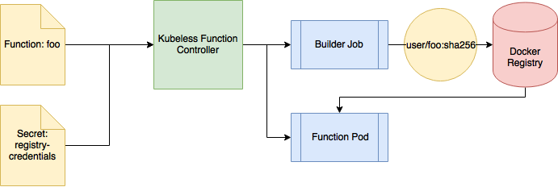

# Build process for functions

> **Warning**: This feature is still under heavy development

Kubeless includes a way of building and storing functions as docker images. This can be used to:

 - Persist function: Functions now become docker images that can be safely stored in a docker registry.
 - Speed up the process of redeploying the same function. This is specifically useful for scaling up your function.
 - Generate immutable function deployments. Once a function image is generated, the same image will be used every time the function is used.

### [Optional] Start a Docker registry

It is possible to use the Docker Hub to store your functions but if you want your functions to be private it is necessary to deploy a different Docker registry. In case you want to use the Docker Hub or if you already have a private Docker Registry jump to the [setup section](#setup-the-build-process). In other case, if you are working with Minikube in a testing environment, you can still deploy a registry as a container in the Minikube VM. For doing that, the first step is to start Minikube setting an insecure registry IP range:

```console
minikube start --insecure-registry 192.168.99.100:5000
```

Note that `192.168.99.100` is the IP that the Minikube VM is going to use in the host machine. You will need to use a different one if the IP of your VM is different. You can retrieve the IP executing `minikube ip`. You can also specify a range: e.g. `0.0.0.0/0` would allow an insecure registry in any IP.

If you already have a running Minikube VM, the previous command would not work since the insecure registry property [is set in the first boot](https://github.com/kubernetes/minikube/issues/604#issuecomment-309296149). If that is your case, stop your minikube instance, edit the file `$HOME/.minikube/machines/minikube/config.json` and change the property `HostOptions > EngineOptions > InsecureRegistry` to specify your IP. Then start your instance again.

Once minikube has started you can start the registry container:

```console
eval $(minikube docker-env)
docker run -d -p 5000:5000 --restart=always --name registry -v /data/docker-registry:/var/lib/registry registry:2
```

That will start the Docker registry using `/data/docker-registry` as the data folder for your images. This directory will be persisted after stopping the Minikube instance [as documented in the Minikube repository](https://github.com/kubernetes/minikube/blob/master/docs/persistent_volumes.md#persistent-volumes).

## Setup the build process

In order to setup the build process the steps needed are:

 - Generate a Kubernetes [secret](https://kubernetes.io/docs/concepts/configuration/secret) with the credentials required to push images to the docker registry and enable the build st. In order to do so, `kubectl` has an utility that allows you to create this secret in just one command:

| **Note**: The command below will generate the correct secret only if the version of `kubectl` is 1.9+ 

```console
kubectl create secret docker-registry kubeless-registry-credentials \
  --docker-server=https://index.docker.io/v1/ \
  --docker-username=user \
  --docker-password=password \
  --docker-email=user@example.com
```

> Note: In case you have followed the [previous guide](#start-a-docker-registry) to deploy an insecure registry you need to specify as docker-server `http://$(minikube ip):5000/v2` and any value as username, password and email.

If the secret has been generated correctly you should see the following output:

```console
$ kubectl get secret kubeless-registry-credentials --output="jsonpath={.data.\.dockerconfigjson}" | base64 -d

{"auths":{"https://index.docker.io/v1/":{"username":"user","password":"password","email":"user@example.com","auth":"dGVfdDpwYZNz"}}}
```

 - Enable the build step in the Kubeless configuration. If you have already deploy Kubeless you can enable it editing the configmap. You will need to set the property `enable-build-step: "false"` to `"true"`. If you are using an insecure registry you will need to set the property `function-registry-tls-verify: "false"` as well.

 ```console
 kubectl edit configmaps -n kubeless kubeless-config
 ```

 - Once the build step is enabled you need to restart the controller in order for the changes to take effect:

 ```console
 kubectl delete pod -n kubeless -l kubeless=controller
 ```

Once the secret is available and the build step is enabled Kubeless will automatically start building function images.

## Build process

The following diagram represents the building process:



When a new function is created the Kubeless Controller generates two items:
 
 - A [Kubernetes job](https://kubernetes.io/docs/concepts/workloads/controllers/jobs-run-to-completion/) that will use the registry credentials to push a new image under the `user` repository. It will use the checksum (SHA256) of the function specification as tag so any change in the function will generate a different image.
 - A Pod to run the function. This pod will wait until the previous job finishes in order to pull the function image.

## Known limitations

 - It is only possible to use a single registry to pull images and push them so if the build system is used with a registry different than https://index.docker.io/v1/ (the official one) the images present in the Kubeless ConfigMap should be copied to the new registry.
 - Base images are not currently cached, that means that every time a new build is triggered it will download the base image.
 
