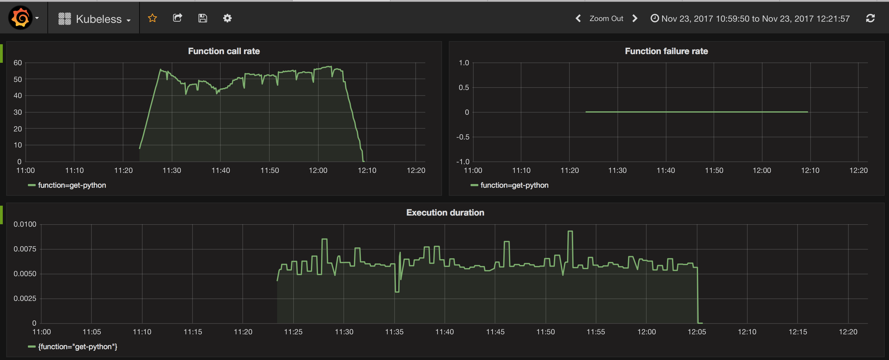

# Monitoring

## Prometheus

Kubeless monitoring relies on Prometheus. The language runtimes are instrumented to automatically collect metrics for each function. 
Prometheus will scrape those metrics and display them in the default Prometheus dashboard.

## Grafana

You could also use Grafana to visualize the prometheus metrics exposed by Kubeless. Example of a Grafana dashboard for Kubeless showing function call rate, function failure rate and execution duration:

Sample dashboard JSON file available [here](./misc/kubeless-grafana-dashboard.json)
