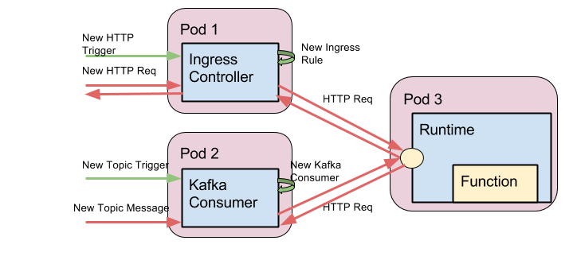

# Decoupling triggers and runtimes

## Definition of the problem
Currently for each new runtime we need to add a container image per trigger. We should design a runtime abstraction. So that:
 - Triggers can be added (http or event or something else).
 - These can be in a single language i.e golang
 - Runtimes can be added more easily
 - One function can be triggered by more than one trigger source

We need to define interface between trigger container and runtime. What type of protocol to use to pass the request and response.

### **Warning**

Changing the interface between triggers (currently embed in the runtime container) and functions will cause a breaking change. Functions working with previous versions of Kubeless may not work depending on the format of the interface chosen.

## User POV
From the users point of view we would support:

```bash
# As today, deploy runtime + trigger
kubeless function deploy func --trigger-http [...]

# Deploy the runtime without a trigger
kubeless function deploy func [...]

# Add a trigger linking it to a function
kubeless trigger add http --path /func func
kubeless trigger add kafka_topic --topic s3 func
```

Note that splitting the trigger type in different "verbs" allow us to easily have flags per trigger type.
Disclaimer: we would need to define possible flags for each trigger
Open question: Do we want to implement a relation 1:N between triggers and functions? (one trigger could call several functions)

## Suggested architecture approach

In order to split runtimes and triggers we need a standalone entity that handles each trigger type. For the moment, we will assume that the interface protocol between the trigger and the runtime will be HTTP (discussed later). 

So far we can identify two types of trigger, we will call them _trigger controllers_:
 - HTTP Trigger: This trigger should redirect HTTP(s) requests from/to the _runtime_. For doing so we can use an Ingress Controller. That way, we can translate each _HTTP Trigger_ for an Ingress Rule.
 - Kafka Topic Trigger: This trigger should translate topic messages to HTTP request. This way runtimes can have an unique interface, regardless of its trigger. Each _kafka trigger_ can be translated to a Kafka consumer.

Note that each one of the entities (runtime, ingress controller, kafka consumer) should be in a different pod because:
 - Once a Pod is running it is not possible to attach new containers. That would make impossible to add new triggers to an existing function if we decide that all the containers should be in a single pod.
 - Several functions can reuse the same ingress controller or kafka consumer. 

This diagram shows the desired architecture (the green arrows show the add trigger workflow while the red arrows the invocation workflow):



Note that this will allow to recollect metrics from the triggers instead of the runtime making it simpler to implement new ones.

## Functions interface
Right now it doesn’t exist a standard for the interface between functions and triggers. The [CNCF document](https://docs.google.com/document/d/1UjW8bt5O8QBgQRILJVKZJej_IuNnxl20AJu9wA8wcdI/) doesn’t get into specifics about how the two pieces should communicate between them or which protocol they should use. Some of the existing solutions are:

 - AWS Lambda:
   - Protocol: The interface between functions and trigger are "events". There are several types of events: s3, DynamoDB, custom applications.
   - Parameters: AWS functions receive different parameters depending on the language but, in general, all the functions receive at least this two: 
     - "event"/"input": This is a blob in which the function receives the information to process. The blob could contain any structure and that will depend on the event source.
     - "context": General information about the function environment. E.g Invoke ID, function version, function ARN…
 - OpenWhisk: 
   - Protocol: A Kafka service transforms HTTP Requests to Kafka messages in any case.
   - Parameters: Functions receive a single argument "parameters" that contains a blob with the body of the HTTP request.
 - Fission:
   - Protocol: Functions request are received in the runtimes as HTTP request what gives the opportunity to give a response directly.
   - Parameters: All the functions receive an object "context". This object has different properties depending on the runtime but as minimum it has a property "request" to read inputs and "response" to answer them.

Regarding the available solutions and the current architecture of Kubeless I would choose a similar solution to Fission/OpenWhisk: Use the HTTP protocol to communicate runtimes and triggers and expose a single parameter. We can tweak this parameter depending on the runtime language in order to give different functionalities (if needed). This is the simplest solution for our use case, the most flexible and it is easy to use. 
As specific proposal, the parameter should contain at least the information about the request. The properties of the request object will change depending on the runtime and the trigger source but in any case it should contain the parameter body with the inputs of the request (the body of a HTTP POST or the message of a Kafka entry). The body can be plain text or a JSON object, see the next section for specific details.

### Function input
Following the above premises and the [CNCF suggestion](https://docs.google.com/document/d/1UjW8bt5O8QBgQRILJVKZJej_IuNnxl20AJu9wA8wcdI/edit#heading=h.3s49zyc) this can be the a possible implementation for the input object that functions will receive the following schema (represented in JSON but the serialization may vary depending on the language):

```json
{
  "data": "string|object",
  "metadata": {
    "type": "string",
    "body": "string",
    ["content-type": "string"],
    ["path": "string"],
    ["method": "string"],
    ["headers": "object"],
    ["topic": "string"],
    ...
  },
  "context": {
    "function-name": "string",
    "runtime": "string",
    "namespace": "string",
    "memory-limit": "string",
    ["schedule": "string"],
    ["logger": "object"],
    ...
  }
}
```

Note: Properties with brackets can be empty. Any required property can be added in the future maintaining backwards compatibility.

 - Data: Serialized version of the request body
 - Metadata: Information about the request
   - Type: Type of the request ("HTTP", "PubSub", "Scheduled", ...)
   - Body: Raw input received
   - Content-type: Explicit content type
   - Path: (HTTP request only) Path of the call 
   - Method: (HTTP request only) HTTP method used (GET, POST, PUT…)
   - Headers: (HTTP request only) Request headers
   - Topic: (PubSub only) Topic of the request
 - Context: Information about the function
   - Function name: ID of the function
   - Runtime: Runtime ID and version
   - Namespace: Kubernetes namespace used
   - Memory limit: Pod memory limit
   - Schedule: Function schedule
   - Logger: (To be implemented) Once we have a way to store and retrieve log this interface should implement the basic methods to write/read them. For the moment we will continue working with stdout so we won’t include this property in the first version.
 
